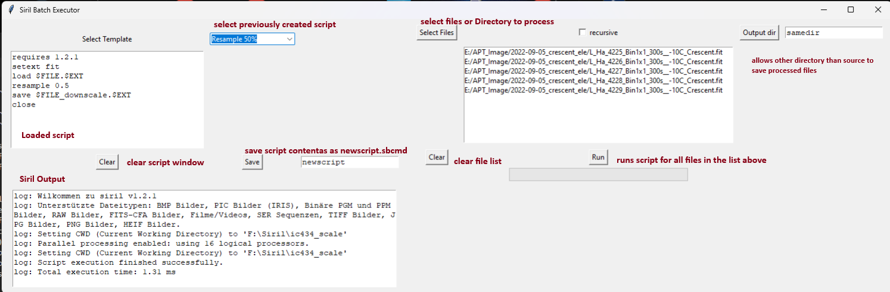

# siril-batch

Runs Siril to execute a script on selected files. 
The files can be selected manually or by a recursive scan.

Scripts can be edited and saved, the scripts will be stored in the
same directory where the pythonscript was found.
The processed files will be either stored in the same directory where the source image has been
found or alternatively in an optional output directory.

## Installation
- Install python https://www.python.org/downloads/
- Install Tkinter ``pip install tk``
### Start
- ``python sbatch.py``

## Variables
- $FILE The fullpath as selected in 
- $EXT The files extension (.fit)

## UI

## Sample Script
The first two line are required by Siril.
load $FILE.$EXT loads the file using its full path
resample 0.5 is the processing 
save appends **_downscale** to the file before the extension is added
close terminates Siril and the next file will be processed.
<pre>
     requires 1.2.1
     setext fit
     load $FILE.$EXT
     resample 0.5
     save $FILE_downscale.$EXT
     close
</pre>
